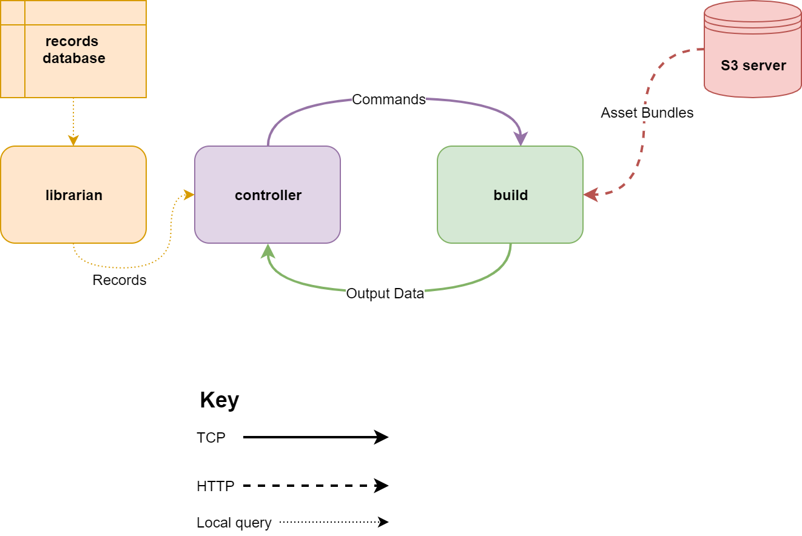
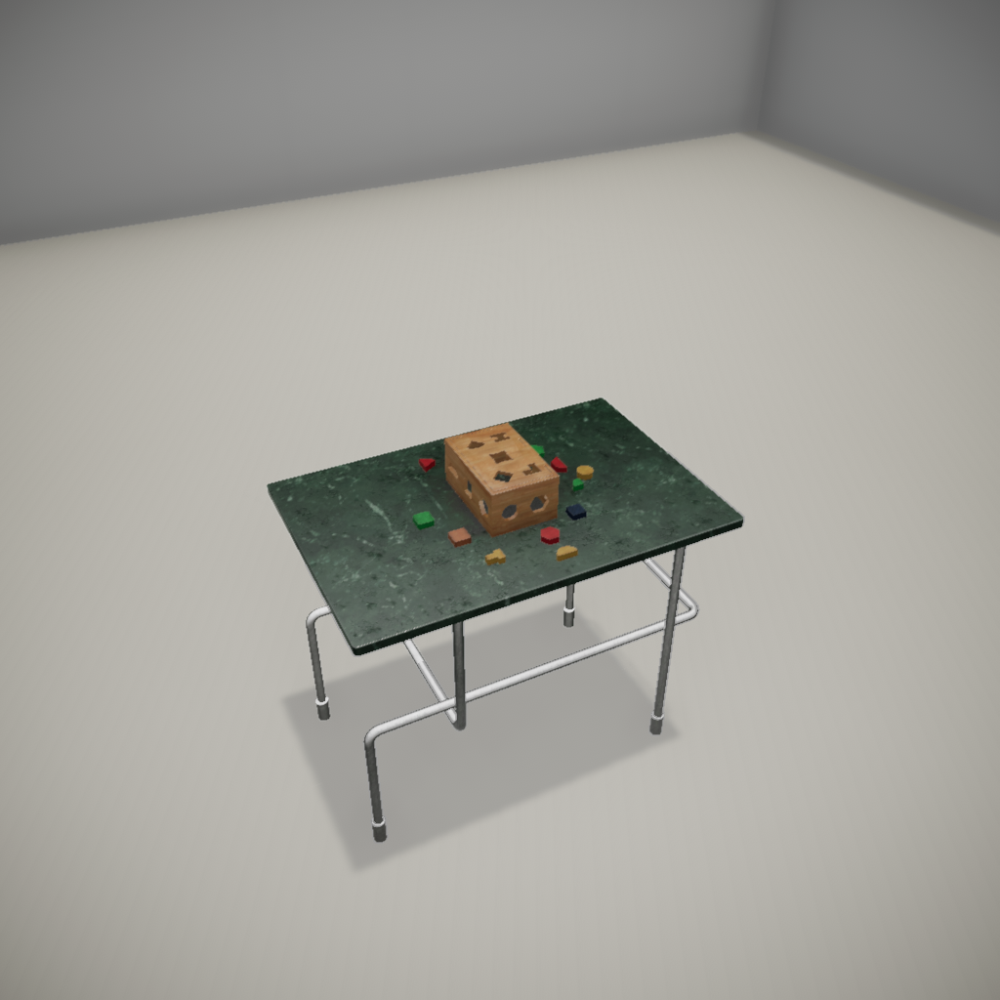

# Getting Started With TDW

## Overview 

**ThreeDWorld (TDW)** is a platform for interactive multi-modal physical simulation. With TDW, users can simulate high-fidelity sensory data and physical interactions between mobile agents and objects in a wide variety of rich 3D environments.

TDW is a general-purpose tool that allows the user to communicate and manipulate a 3D environment. As such, there's no single "correct" procedure for using TDW. This guide will show you how to start using TDW and how to explore the available options.

## What you need to know

- Some familiarity with running programs from the command line.
- Beginner Python3 skills.

## Requirements

- Windows, OS X, or Linux
- Python 3.6+
- A GPU, the faster the better. It is possible to run TDW without a GPU but you will lose some speed and photorealism.
- For [audio/video recording](misc_frontend/video.md), you will need an audio driver.
- [Flex](misc_frontend/flex.md) has complicated requirements; please refer to the linked document.

#### Remote server requirements

* **The build requires X.** 
* We have tested the build in Ubuntu 16 and 18.
* The server must have 8 or less GPUs. (If there are more, you can temporarily disable them by editing xorg.conf)

## Further documentation

**TDW is EXTENSIVELY documented.** For a full list of documents and topics covered, see the [README](../README.md).

## Installation

2. Install the `tdw` Python module:

| Windows                   | OS X and Linux        |
| ------------------------- | --------------------- |
| `pip3 install tdw --user` | `sudo pip3 install tdw` |

3. Run a minimal controller script (this will install the build):

```bash
cd tdw/Python/example_controllers
```

Then:

```bash
python3 minimal.py
```

3. Read the rest of this document.

### How to run the build

The **build** is the binary executable that handles the actual simulation (rendering, physics, and so on). As with any application, you can double-click on the build or launch it from a shell.

By default, the build will launch when you run any controller. To disable this behavior, set `launch_build` to `False`:

```python
c = Controller(port=1071, launch_build=False)
```

The build is located at: `~/tdw_build/TDW` (where `~` is your home directory).

### Less-minimal simulation

Create a basic simulation in which objects are added into the 3D environment and images are routed to the controller and saved to the local disk:`tdw/Python/example_controllers/example_output/`

```bash
cd tdw/Python/example_controllers
```

```bash
python3 objects_and_images.py
```

## Core concepts



TDW has the following core components:

1. **The build** is the 3D environment application. It is available as a [compiled executable](https://github.com/threedworld-mit/tdw/releases/latest).
2. **The controller** is an external Python script created by the user that communicates with the build.
3. **The S3 server** is a remote server. It contains the  binary files of each model, material, etc. that can be added to the build at runtime. These binary files are called [asset bundles](https://docs.unity3d.com/Manual/AssetBundlesIntro.html).
4. **The records databases** are a set of local .json metadata files with **records** corresponding to each asset bundle.
5. A [**librarian**](python/librarian/librarian.md) is a Python wrapper class to easily query metadata in a records database file.

### The simulation pattern

1. The controller communicates with the build by sending a list of  [**commands**](api/command_api_guide.md).
2. The build receives the list of serialized commands, deserializes them, and executes them.
3. The build advances 1 _physics frame_ (simulation step).
4. The build returns [**output data**](api/output_data.md) to the controller.

#### Output Data

Output data is always sent as a list, with the last element of the list being the frame number:

```
[data, data, data, frame]
```

If the build has no data to send, it will send `[frame]`.

## The build

### Terminology

- The **Unity Engine** is the underlying architecture of the build. Unity is powerful and solves a lot of the hardest tasks automatically, such as calculating lighting and shadows. However, Unity is closed-source; a significant portion of the engine is "black-box".
- A **scene** is a blank slate that can be populated with meshes, scripts, etc. Scenes are intrinsic to Unity.
- An **environment** is a TDW idiom for a space within a scene that can be populated with objects. The default proc-gen room created by the [`create_exterior_walls`](api/command_api.md#create_exterior_walls) command has 1 environment. Scenes loaded from asset bundles may have additional environments, which represent open spaces.
- An **avatar** is an object in TDW that can be "piloted" by TDW and return data (usually images).
- An [**asset bundle**](https://docs.unity3d.com/Manual/AssetBundlesIntro.html) is a Unity Engine binary file for loading assets into the executable at runtime. To query which asset bundles are included in TDW, use a [librarian](python/librarian/librarian.md).

### Command-line arguments

The build accepts several command-line arguments. Command-line arguments should always be formatted `-flag=argument`:

`./TDW.exe -port=1204`

| Flag                  | Description                             | Default   |
| --------------------- | --------------------------------------- | --------- |
| `-address`      | Address of the controller                       | localhost |
| `-port` | Network port for sending and receiving messages | 1071   |
| `-screenWidth`        | Width of the screen                     | 256       |
| `-screenHeight`       | Height of the screen                    | 256       |
| `-gpuDevice`          | GPU device number used for CUDA (Flex)  | 0         |
| `-force-glcore42` | Force the build to run on OpenGL 4.2 (see [Debug TDW](misc_frontend/debug_tdw.md)).<br>This is one of many [Unity arguments](https://docs.unity3d.com/Manual/CommandLineArguments.html), all of which can be used for a TDW build. | N/A |

### Running the build on a remote server

- See **Requirements** for system requirements.
- Make sure that xorg is set up correctly such that there is a virtual display that you can launch the build on.
- Use the `run_build.sh` script located in `tdw/bash/` or the [Docker container](Docker/docker.md).

## The controller

All controllers are sub-classes of the `Controller` class. Controllers send and receive data via the `communicate` function:

```python
from tdw.controller import Controller

c = Controller()

# resp will be a list of one element: [frame]
resp = c.communicate({"$type": "load_scene", 
                      "scene_name": "ProcGenScene"})
```

_NOTE:_ In many example controllers, you will see a function `self.start()`. This is a wrapper function for the `load_scene` command.

Commands can be sent in lists of arbitrary length, allowing for arbitrarily complex instructions per frame. The user must explicitly request output data:

```python
from tdw.controller import Controller
from tdw.tdw_utils import TDWUtils
from tdw.librarian import ModelLibrarian
from tdw.output_data import OutputData, Bounds, Images

lib = ModelLibrarian("models_full.json")
# Get the record for the table.
table_record = lib.get_record("small_table_green_marble")

c = Controller()

table_id = 0

# 1. Load the scene.
# 2. Create an empty room (using a wrapper function)
# 3. Add the table.
# 4. Request Bounds data.
resp = c.communicate([{"$type": "load_scene",
                       "scene_name": "ProcGenScene"},
                      TDWUtils.create_empty_room(12, 12),
                      {"$type": "add_object",
                       "name": table_record.name,
                       "url": table_record.get_url(),
                       "scale_factor": table_record.scale_factor,
                       "position": {"x": 0, "y": 0, "z": 0},
                       "rotation": {"x": 0, "y": 0, "z": 0},
                       "category": table_record.wcategory,
                       "id": table_id},
                      {"$type": "send_bounds",
                       "frequency": "once"}])
```

The `resp` object is a list of byte arrays that can be deserialized into output data:

```python
# Get the top of the table.
top_y = 0
for r in resp[:-1]:
    r_id = OutputData.get_data_type_id(r)
    # Find the bounds data.
    if r_id == "boun":
        b = Bounds(r)
        # Find the table in the bounds data.
        for i in range(b.get_num()):
            if b.get_id(i) == table_id:
                top_y = b.get_top(i)
```

The variable `top_y` can be used to place an object on the table:

```python
box_record = lib.get_record("iron_box")
box_id = 1
c.communicate({"$type": "add_object",
               "name": box_record.name,
               "url": box_record.get_url(),
               "scale_factor": box_record.scale_factor,
               "position": {"x": 0, "y": top_y, "z": 0},
               "rotation": {"x": 0, "y": 0, "z": 0},
               "category": box_record.wcategory,
               "id": 1})
```

Then an **avatar** can be added to the scene. In this case, the avatar is just a camera. The avatar can then send an image:

```python
avatar_id = "a"
resp = c.communicate([{"$type": "create_avatar",
                       "type": "A_Img_Caps_Kinematic",
                       "avatar_id": avatar_id},
                      {"$type": "teleport_avatar_to",
                       "position": {"x": 1, "y": 2.5, "z": 2}},
                      {"$type": "look_at",
                       "avatar_id": avatar_id,
                       "object_id": box_id},
                      {"$type": "set_pass_masks",
                       "avatar_id": avatar_id,
                       "pass_masks": ["_img"]},
                      {"$type": "send_images",
                       "frequency": "once",
                       "avatar_id": avatar_id}])

# Get the image.
for r in resp[:-1]:
    r_id = OutputData.get_data_type_id(r)
    # Find the image data.
    if r_id == "imag":
        img = Images(r)
```

This image is a numpy array that can be either saved to disk or fed directly into a ML system. Put together, the example code will create this image:



## Restarting a simulation

To restart a simulation, **always kill the controller _and_ the build.** Never recycle a build or controller instance!

Kill the build by sending `{"$type": "terminate"}`:

```python
c = Controller(launch_build=True) # Launch the build.
c.communicate({"$type": "terminate"}) # Terminate the build.
```

